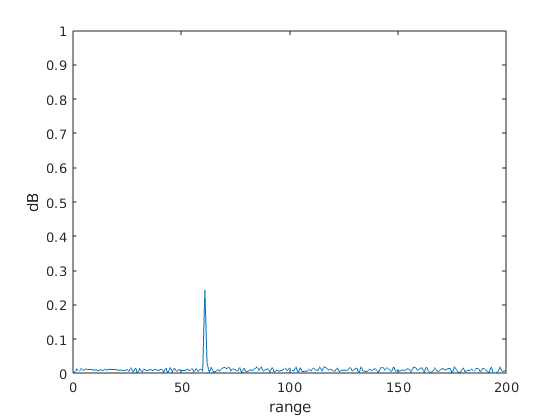
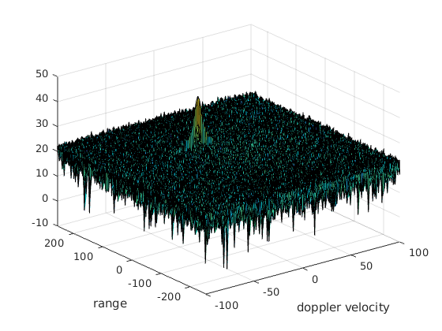
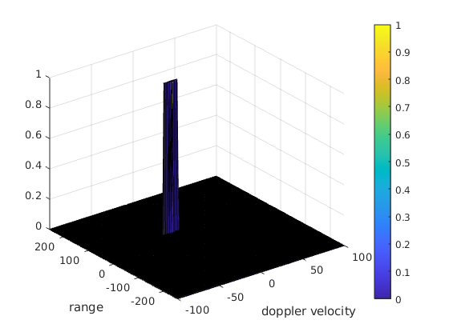

# Radar target generation and detection


## 2D CFAR Implementation

1- Determine the number of training cells and guard cells for each dimension.

The number of training cells should be decided based on the environment. Since there is only a single simulated target, 
when in doubt more training cells should be used to estimate noise, as the target reflects into a lot of cells.

The Guard Cells avoid the target signal from leaking into the training cells that could adversely affect the noise estimate. 
The number of guard cells should be decided based on the leakage of the target signal out of the cell under test. 
If target reflections are strong they often get into surrounding bins. 

The following estimates were based on a visual estimate of the doppler range map and then tweaked:

```
Tr = 20;        %Number of training cells for range
Td = 18;        %Number of training cells for doppler   

Gr = 7;         %Number of guard cells for range
Gd = 7;         %Number of guard cells for doppler

```

2- Determine the threshold offset by SNR value in db

` offset = 12; `

3- Slide the cell under test across the complete matrix.

We define a `noise_level` vector to store the average noise across the training cells, compute the `threshold` and
check if the cell under test is below or above threshold.

```
for i = Tr + Gr + 1:Nr/2 - (Tr + Gr)
    for j = Td + Gd + 1:Nd - (Gd + Td)
        
        noise_level = zeros(1,1);
        
        for p = i - (Tr + Gr):i + (Gr + Tr)
            for q = j - (Td + Gd):j + (Gd + Td)
            
                if (abs(i - p) > Gr || abs(j - q) > Gd)
                    noise_level = noise_level + db2pow(RDM(p, q));
                end
            end
        end
        
        threshold = pow2db(noise_level/((2 * (Td + Gd + 1)  * 2 * (Tr + Gr+ 1) - (Gr * Gd) - 1)));
        threshold = threshold + offset;

        cut = RDM(i,j);
        
        if(cut > threshold)
            RDM(i,j) = 1;
        else
            RDM(i,j) = 0;
        end        
    end
end

```
  
4- Correct the values at the edges of matrix

```
for i = 1 : Nr/2
    for j = 1:Nd
        if (RDM(i,j) ~= 0 && RDM(i,j) ~= 1 )
             RDM(i,j) = 0;
        end
    end
end

```

### Result figures

 
 
 
 
 
 
 
